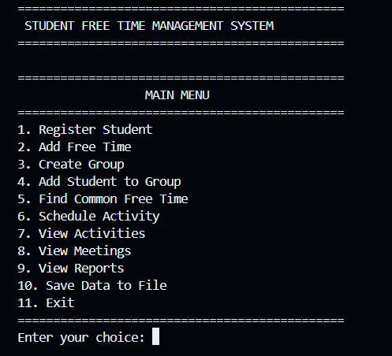

# 🚀 SYNCSPACE — Student Free Time Management & Collaborative Activity Scheduler
 
## 📌 Overview 
This project implements a console-based Java application that helps students manage their free time and coordinate group activities efficiently.
 
The system allows students to:
- Register student details
- Add and manage free-time slots
- Create student groups
- Add students to groups
- Find common free time among group members
- Schedule activities and meetings
- View activities and meetings
- Generate project reports
- Save project data to files
 
---
 
## 🎯 Objective 
To design a student scheduling system that:
- Manages student information
- Handles individual free-time schedules
- Finds common available time for groups
- Supports collaborative activity scheduling
- Detects scheduling conflicts
- Maintains meeting and activity information
- Stores project data using file handling
 
---
 
## 🧠 Concepts Used 
- Object-Oriented Programming (OOP)
- Classes and Objects
- Encapsulation
- Java Collections
- Exception Handling
- Custom Exceptions
- Java Date and Time API
- Input Validation
- File Handling
- Java NIO Files and Path
- Modular Programming
- Service-Based Architecture
 
---
 
## ⚙️ Technologies 
- Java 11+
- Java Collections Framework
- Java `java.time` Package
- Java NIO
- Scanner
- GitHub
- GitHub Codespaces
 
---
 
## 🧩 Problem Setup 
- Students register their personal academic details
- Students define their available/free-time slots
- Groups are created for projects, clubs, studies, or competitions
- Students can be added to groups
- The system identifies common free time among group members
- Activities can be scheduled during suitable time slots
- Meetings are automatically maintained for scheduled activities
- Project information can be saved to a file
 
---
 
## 🧮 Cost Function 
The system focuses on finding suitable common free-time intervals rather than using a numerical cost function.
 
For a group of students, the common available interval is determined by comparing the schedules of all group members.
 
For example:
 
```text
Student 1: 16:00 - 19:00
Student 2: 17:00 - 20:00
Student 3: 17:30 - 19:30
Student 4: 18:00 - 20:00
 
Common Free Time: 18:00 - 19:00
```
## 🔍 Algorithms Used
1. Schedule Matching (Main)
- Compares the free-time schedules of group members
- Identifies overlapping time intervals
- Finds the time periods when all group members are available
- Helps select a suitable time for collaborative activities
  
2. Validation
- Validates student information
- Checks duplicate student IDs
- Validates group and student existence
- Checks valid start and end times
- Prevents duplicate activity IDs
- Handles invalid scheduling operations

## 🏃 How to Run
java -version
javac -version

mkdir -p out
javac -d out src/exception/*.java src/model/*.java src/service/*.java src/util/*.java src/Main.java

java -cp out Main

## 📊 Output


## 🔮 Future Work
- Graphical User Interface (GUI)
- Web-based application
- Database integration
- Student login and authentication
- Email notifications
- Calendar integration
- Automatic conflict resolution
- Recurring activities
- Mobile application
- Cloud-based data storage
- Advanced scheduling algorithms

## 📚 References
- Java Documentation
- Java Collections Framework
- Java Date and Time API
- Java NIO Files API
- Object-Oriented Programming Concepts
- GitHub Documentation
- GitHub Codespaces Documentation
